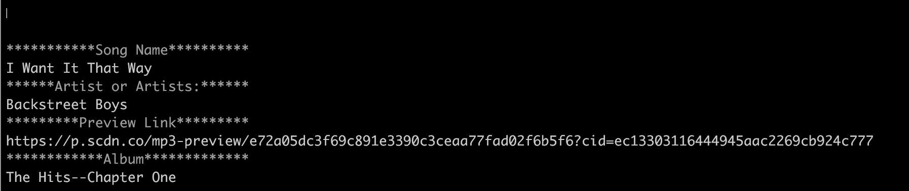
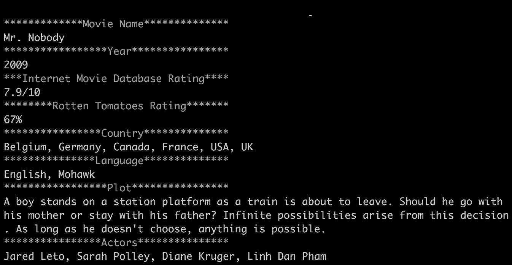

# LIRI-BOT

This application is like SIRI, one can get LIRI to play/get songs and pull up movies. The difference is that Liri is a language interpretation and recognition interface.

Node packages that are needed for the assignment:
    Node-Spotify-Api
    Axios - will grab datat from OMDB API and Bands In Town API
    Moment
    DotEnv

Technology Used
Node.js
spotify codes

    
    
    
    
    